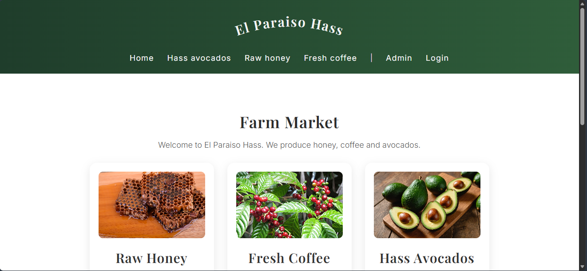
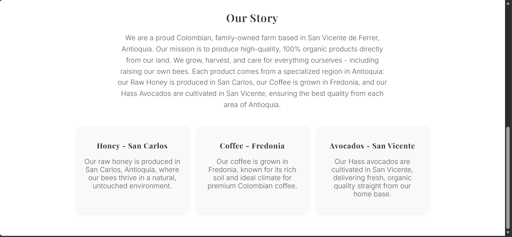
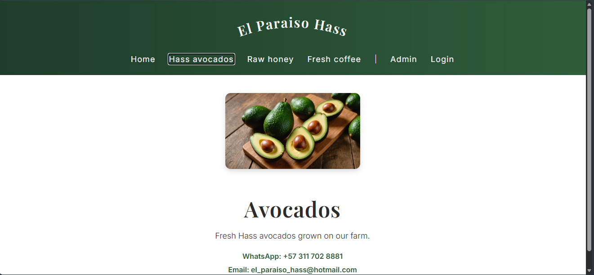
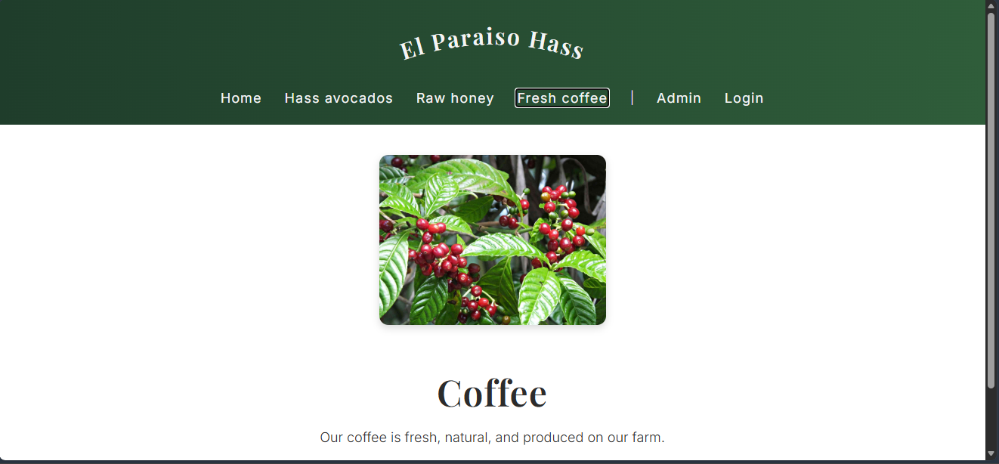
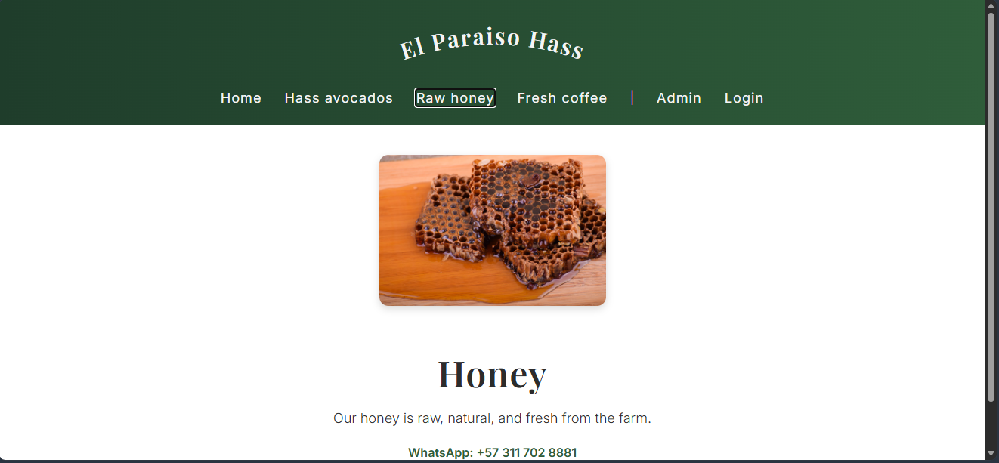
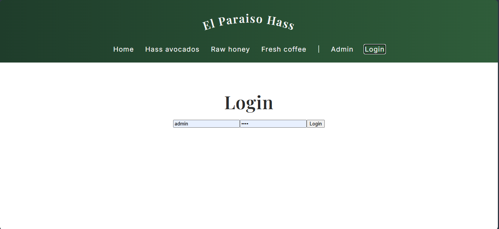
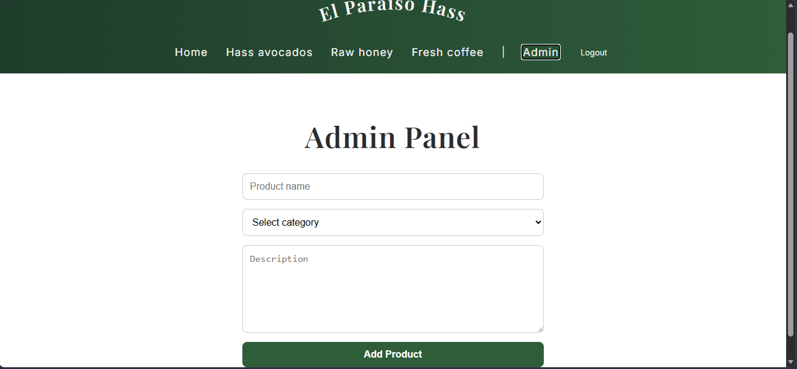

# Farm Market App

A full-stack farm products marketplace web application built with React, Flask, and SQLite.

This application allows users to browse natural farm products from Antioquia, Colombia, including:

- Raw Honey
- Coffee 
- Hass Avocados

The project includes a React frontend and a Flask backend with product routes and admin functionality.

---

# Features 

- React frontend using Vite
- Flask backend API
- SQLite database integration
- Product pages 
- Login system
- Admin panel
- Responsive navigation bar
- Product image support 

---

# Technologies Used

## Frontend 
- React
- Vite
- JavaScript
- CSS

## Backend 
- Python 
- Flask 
- SQLite

---

# Project Structure

```txt
farm-market-app/
├── backend/
├── frontend/
├── screenshots/
|
├── app.py
├── db.py
├── init_db.py
│-- products.py
|
├── .gitignore
```

---

# Installation

## Clone Repository

```bash
git clone https://github.com/mabebeta/farm-market-app.git
```

---

# Backend Setup

```bash
cd backend 
pip install flask
python app.py
```

---

# Frontend Setup

```bash
cd frontend 
npm install
npm run dev
```

---

# Screenshots

## Home Page





---

## Avocados Page



---

## Coffee Page



---

## Honey Page



---

## Login Page



---

## Admin Panel



---

# Future Improvements

- Shopping cart
- Online payments
- User accounts
- Order tracking
- Product inventory system
- Deployment to cloud hosting

---

# Author 

Developed by Marcelo Berrio
